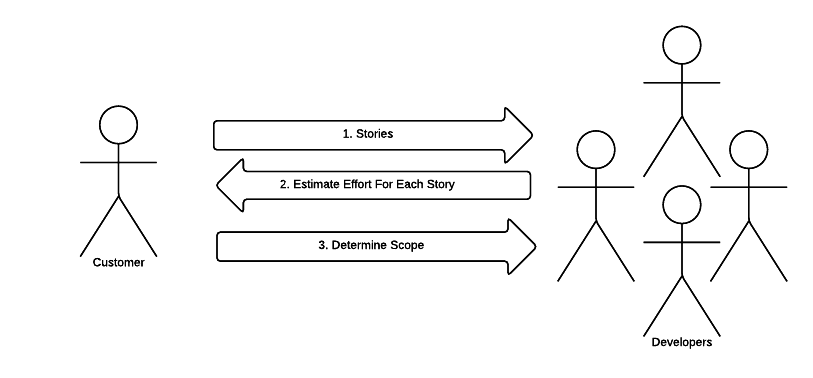
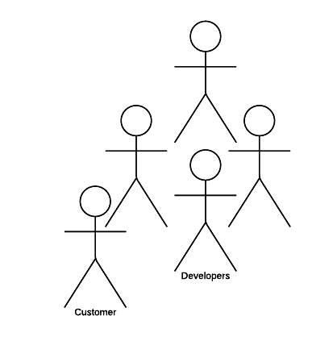

#eXtreme Programming (XP)
*Neil Taylor, A6 Llandinam*

##Kent Beck
eXtreme Programming...:
* Is about societal change
* Is about letting go of habits and patterns that were adaptive in the past
* Giving up the defenses that protect us
* May leave us feeling exposed

##eXtreme Programming Overview:
* Published in 1999 by Kent Beck
    * Developed while working on the C3 project
* Motivations:
    * Need to embrace change
    * Perceived "cost of change" curve
* eXtreme Programming "flattens the curve"
* Project Life Cycle
* eXtreme Programming Practices

##Traditional Problems
* Success is just luck
* Integration nightmares
* Low sponsor expectations
* "Smelly" Software that is...
    * Brittle - Doesn't work in certain situations
    * Wrong features
    * Missing/Broken features
    * Buggy

##In XP...
* There is a fixed time period (iteration) to complete the task
* Tasks (analysis, design etc.) are not always sequential and sometimes happen in parallel

##XP Values##
* **Simplicity**
    * Do what is needed, no more
* **Communication**
    * XP demands communication
* **Feedback**
    * Continual feedback loop with stakeholders. Adapt process to fit the project.
* **Courage**
    * Have the courage to be open about progress, and the courage to make changes.
* **Respect**
    * Between developers, and between developers and stakeholders

##eXtreme Programming Practices
###Practice 1
---

###Practice 2
---
####Test-Driven Development
* **Unit Testing**
    * Tests the logic of the code
* **Acceptance Testing**
    * Tests the logic of the application
* The key is automation where possible

###Practice 3
---
####Pair Programming
* Design and development in pairs
    * Constant code review
    * Constant communication during development

###Practice 4
---
####Merciless Refactoring
* Improving code without changing it's functionality

###Practice 5
---
####Simple Design

* Incremental Design
* Find the simplest design that will solve the Problems
* YAGNI
    * **Y**ou **A**ren't **G**onna **N**eed **I**!

###Pracice 6
---
####Collective Code Ownership
* Everybody owns the code
* If you break the code, you need to fix the code
* If you need to change the code, then you can! (But talk to the team first)

###Practice 7
---
####Continuous Integration

* Integrate the code in an integration platform several times a day

###Practice 8
---
####On-Site Customer

The customer works as part of the team

###Other Four Practices
---
9. Small releases
10. Sustainable development - avoid burnout and workforce attrition
11. Coding standards
12. System metaphor

###Additional Practices
---
* Daily stand-ups
* Retrospectives
* Shore and Warden talk about "Clarifying Practices", which help the team function
