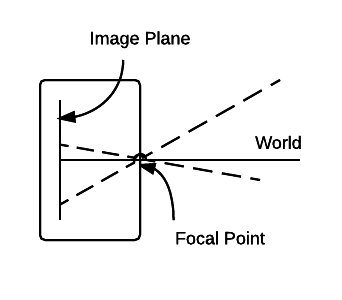

#Image Formation
*Hannah Dee, Physics B, 13/10/15*

"How do you get from a 3D world to a 2D representation of that world, and what information can we extract from that?"

##Geometry Of Image Formation

###A Simple Model: Pinhole Camera

* The distance camera-object is not recoverable by a single viewpoint
