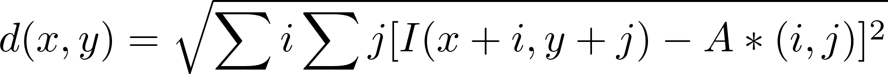
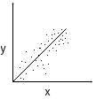
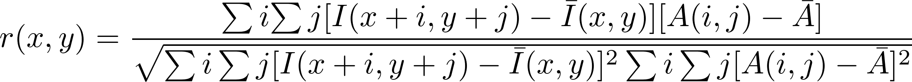
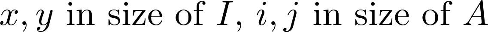
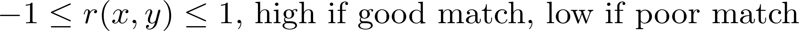

# Appearance & Patch Based Methods
*Hannah Dee, Physics B*

## Appearance Of Objects As Features

### Appearance Vs. Geometry
* Appearance: the way things look
* One of several images of objects
* Problem: Finding an object in an image

### Comparing Images
* Similar to convolution
* Various Methods:
    * Correlation Coefficient
    * Euclidean Distance a.k.a. Sum of Squared Distances (SSD)
    * Mutual Information *(not covered here)*

### Notations & Constraints
* *I* is an image
* *A* is the appearance of an image
* *A < I*
* Origin is the top-left corner
* The following definitions assume that the image is greyscale, but it is possible with colour also

### Euclidean Distance


* SSD is the same without the square root
* Simpler
* Not normalised
* Use of different/better colour space

```
for(i : [0 .. A.w]):
    for(i : [0 .. A.h]):
        s+= I(x+i, y+j) - A(i,j)
    endfor
endfor
```
### Correlations
* Measure of how variable *x* changes with regards to variable *y*
* Do not imply causation, but they can suggest a link



### Why Would We Use Correlations?
| Pros | Cons |
| ---- | ---- |
| Robustness to brightness | Not Perfect |
| Small robustness to noise and image patches | Not as fast as Euclidean distance |

### Correlation Coefficients







## Search Is A Big Problem
### Finding A Good Match
* Search Problems
    * Exhaustive
    * Guided and/or constrained
    * Sub-pixel values
* Problems
    * Scale
    * Orientation
* Solution
    * Dynamic image resampling
        * Image pyramids
    * Geometrical transformation of pixel positions
  
