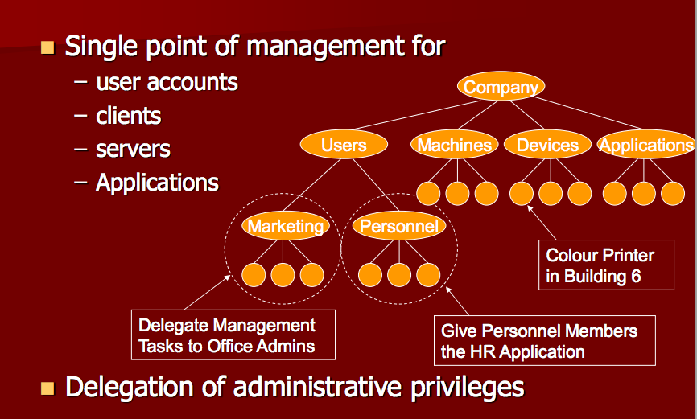

Internet Admin: Naming and Directory Services
====

DNS:
* Domain Name Service
* Maps hostnames to IP Addresses
* Distributed database
* DNS Servers (client server architecture)

Database vs Directory Services:
* DNS tolerant to getting out of date
* DNS has to respond quickly
* DBs need roll-back, up-to-date information
* DNS is a DISTRIBUTED DB
* No one part to be responding for everyone at the same time

---

#### Before DNS:
* Had to name the computer you wanted to communicated with
* Using hostfile
* Windows:
  * HOSTS
  * LMHOSTS
* Unix:
  * /etc/hosts
* If you want to talk to lots of people, hostfile gets large
* Someone new? They're not in your hostfile
* Files providing name/address mappings
* Still check hostfile before DNS now
* Therefore can 'overwrite' IP addresses for websites you might want to (eg. adware)

#### How is the DNS used?
* Apps access the information in the DNS by way of resolver programs
* nslookup (or 'dig') -> www.google.com -> gives IP address
* google uses load balancing and has 2+ IP addresses
* Common implementation of DNS client and server programs in BIND (Berkeley Internet Domain Server)
* DNS uses a protocol (RFCs) that is used for communication between client & server
* gethostbyname()
* gethostbyaddr()
* RFC = Request For Comments

#### DNS Name Space:

* Top level domain names
* 2 letter = country
* UK official code = GB
* In 2000, ICANN approved new, even more now
* NOMINET

* Different people look after the root to the top-levels
* NOMINET = UK
* Each is it's own, owned separately

Domain Name walk - goes root -> points to UK -> points to ac -> etc.

* ARPA does reverse lookups by IP address
* ARPA -> Inaddr = come together

#### Where is the root?

* (x,y) x is the # of root servers, y is the # of gTLD servers
* Anycast IP:
  * Same IP addresses, multiple computers
  * Clones of the roots
  * Now all over the world (see below)
  * Still only the 13 original

---

#### Name Servers & Zone Boundaries

---

#### Recursive Search

* DNS Server does the lookup for you
* On Uni Network, tells you in configuration where the nearest DNS server is

* Local, preferred DNS server does IP lookup for you
* DNS Servers talks to root -> com -> microsoft -> etc

* Don't need to configure your own machine to the 13 roots
* DNS Servers cache the results (if someone searches again, retreives from cache instead)
* Reduces # of DNS walks needed

TTL (Time to Live) on information in cache on server (default is 2 days)

If you change the IP address:
* Reduce TTL to 30mins
* Those who use often will have the old one in cache otherwise

Resource Records:
* TTL column
* Class (N = Internet)
* Type (see next section)

#### Type

* *SOA:* Start of authority, what is the DNS's zone of authority
* *A:* Address record, hostname & IP address
* *PTR:* Pointer, pass IP address and get name (reverse lookup)
* *CNAME:* Aliases, inside or outside of zone (outside causes extra lookups...)
* *MX:* Mail exchanger, emails, x@aber.ac.uk, gives you IP Address of the mail servers, also has an 'A' associated
* *NS:* Name Server, DNS Servers in this Zone

> 1 Aberystwyth DNS server is in Birmingham for Disaster recovery

> Reverse DNS: for spam filtering, checks where the email originated from and check against the email address, do they match?

---

### What are Directories?
* They are databases optimised for lookups
* Only updated occasionally relative to the number of reads / searches
* Entries have attributes which have values
* Could use to list printers or students...
* Tolerant of inconsistencies

### Selecting a naming / directory Service
* Normally done in /etc/nsswitch.conf
* Allows choices between:
  * Plain text
  * DNS
  * NIS and NIS+
  * LDAP
  * And a few more...
* Sharing information around a network:
  * Password hashes
  * User accounts
  * Details
  * Etc

##### NIS:
* Network Information Service
* Unix, by Sun
* Holds:
  * Usernames / passwords
  * hostnames
  * groups and their membership
  * netgroups
  * mail aliases
  * Services
  * All information stored in a set of 'maps'
* Master Servers:
  * All the information
  * Maintain maps
  * Distribute when required
  * Answer queries from clients
* Slave servers:
  * Acquire information from masters
  * Answer queries
* Cons:
  * Handling of shadow password Files
  * Server & Client hanging and not rebinding
  * Slave servers can get out of sync
  * Not secure in many ways
  * Bogus servers
* Pros:
 * Relatively easy for admins
 * Needs little knowledge to use

http://www.bblisa.org/pipermail/bblisa/2006-October/001020.html

---

##### LDAP
* Lightweight Directory Access protocol
* Internet way of accessing online directory system
* Uses X.500 information model
* Designed to use TCP/IP
* Defines the interface only
* Information Model:
  * Based on Entries
  * Entries = Attribute Value pairs
  * Attributes described by the schema

##### Active Directory

