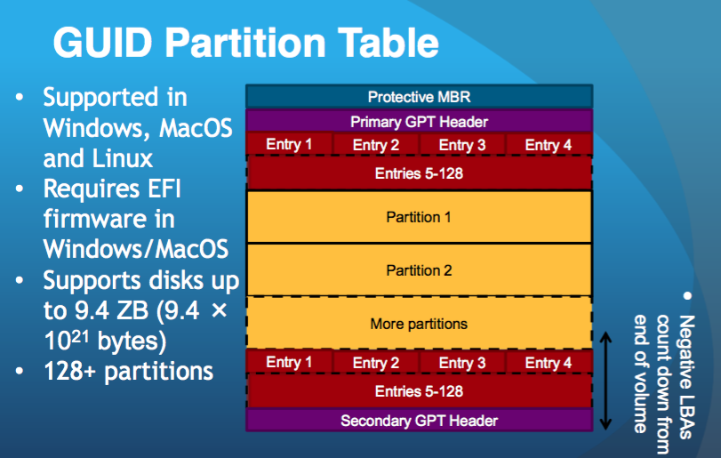

Internet Services: System Startup/Shutdown and Process Management
======

* All unreferenced images from Aberystwyth University Lecture slides

#### Old style

* To have more than 4 partitions - need an extended partitions
* MBR = Master Boot record
* MBR takes boot sector from partition boot record

BIOS -> MBR -> Partition BR

If you overwrite MBR:
* won't boot
* BIOS won't test
* target for viruses

#### Why rotational HD for servers still?
* Access time
* Costs (to replace / build in first place)

#### Flash Drives
* Get worn down as your erase data
* Wear-leveling moves data around
* Stops you wearing down one area
* Flash drive has a map of where the data is
* *Lose Map, cannot find files*
* *Disk recovery software doesn't work on flash with no map*

#### Old HD Layout

* Head reads the data in a track
* Due to the tighter packed inner tracks, head reads outer track slower

#### New HD Layout

* Less blocks in the middle
* Reads outside faster, as ~2x as much data
* OS is on outer layer
  * Read faster
  * Being read all the time
* User data much further in on the Disk
  * Not accessed as much
* How is the OS on the outside?
  * Partitioning!
  * Partition 1 is on the outside

> More RAM - less virtual memory used - quicker running

#### SWAP Partitioning:
* Linux
* OS takes some memory from application not in use
* Store this on the HD
* Frees up memory for running applications

#### Why partition?
* Separate OS from data (Principle 12: Separation)
* Make better use of disk space
* Ease of upgrades (just the OS, leave the data alone)
* Improved performance (less metadata)
* Disk size limitations
* Avoid filesystem fragmentation
* Easier to administer:
  * Backup (just data partition)
  * Breaks (reimage the OS)

Issues:
* How big?
* Labelling

---

#### Extensible Firmware Interface
* Every partition has a GUID (or UUID)
* Unlimited # of partitions
* Multiple copies of boot sector
* First partition provides backward MBR compatibility

M.Sikma, Creative Commons BY-SA 2.5

#### Unlimited # of partitions?
* Each has a UUID
* Only limited by the size of the disk

#### Windows Disk Partition:

* Recovery in front of OS
* Lose fastest part of rotational disk

---

### Windows Boot

Miracle:

##### Micro-Kernel - no longer like this:
* Small kernel (Windows only)
* No file system inside
* No device drivers inside
* Separate memory for this from processes
* Stops writing over kernel memory
* File system _cannot_ access kernel memory
* Have to copy kernel memory, send to file system - _INEFFICIENT_

### Comparison between Monolithic & Micro kernel:

#### Monolithic-kernel (Unix):
* Everything inside
* Process management, memory management, file system etc
* To add new file system, need to recompile kernel & reboot

#### Modular kernel:
* Kernel compiled with main pieces
* Leave hook in kernel to add additional code as required - finds running code and adds to running kernel
* Quicker than Monolithic

### GUID Partition table

---

#### Coreboot:

* Alternative for Linux
* Works with legacy systems (switches to 32-bit quickly)
* Minimum Tasks necessary
* Open source
* Extensible
* Multiple payloads
* Mostly on embedded now - not PCs

---

### Cluster Sizes:

* PC disks use 512B sectors
* NTFS allows a cluster size to be specified (always multiple of 512B)
* Cluster size up to 64k supported
* However only up to 4k allows compression

#### Create file system
* Have to be laid out, be able to find files easily
* Have to find start and end
* Need random access - to find middle
* Virtual machine:
  * Needs virtual HD (essentially large file)
  * Don't want to read this in it's entirety
* Needs name, where it is on the disk etc
* Metadata! Can get large if you use small block sizes

#### Cluster basics:
* Groups of 512B disk blocks
* Read as one
* Only need to look up 1 piece of metadata
* More efficient?
* Empty space, if don't all fit perfectly
* Small cluster sizes works best for tiny files
* Windows defaults to larger cluster, faster access

---

#### Which filesystem???

#### UNIX Filesystems
##### EXT2:
* Non-journaling
* inodes point to disk data blocks
* adjustable blocks per inode (cluster size)
* may adjust number of inodes:
  * only when created

##### EXT3:
* Adds a journal to EXT2
* However has a performance penalty

#### Uses EXT4 now

##### HFS+
* FAST
* If you lose metadata, cannot manually put files back together as split into pieces
  * Single data structure on Mac
  * Disk Warrior _tries_ to reconstruct
* Break up metadata structure into several pieces
  * HFS doesn't do this

---

#### Windows Registry
* Gets backed up
* Everything in one place

#### Reiser File System

---

#### Delayed Write
Pros:
* Processes need not be blocked for slow IO operations
* Many writes never make it to disk at all
* More data can be handled at once

Cons:
* System failure can cause file loss
* DBs & Processes using shared files need must avoid caching

> Removing USB without ejecting, file isn't there because of delayed write
* Memory buffer needs to be saved onto device for fast recovery - not straight after moving file over
* Eject device forces memory buffer to save immediately

---

#### Journaled filesystem
* Save from FSCk (or similar)
* Write data to log file
* Automic operation - cannot be broken up
* Can check log file to see what went wrong on power off

1. Header
2. Block updates
3. Header updated to reflect completion of block updates

---

#### Unix Run Levels

* Chooses which processes you want to run

##### Single User mode:
* Designed for admin. maintenance
* No network code loaded
* Getty not started (physical / virtual terminals)
* Single user password provides security
* Allows hardware maintenance and debugging of problematic systems
* Only root filesystem is mounted by default

#### Loading Unix
1. Boot Manager start kernel
2. First process (init) is started
3. Init checks filesystem integrity before mounting filesystems in read/write mode
4. Paging areas designated
5. Filesystem cleanup, preservation of editor buffers etc.
6. Daemons started for major subsystems
7. Networking code and daemons started, remote disk space mounted
8. Remove /etc/nologin and start getty

---

### Process Management

#### Process Lifecycle

#### Process cleanup
* Process finishes, calls 'exit' to notify kernel it's ready to die
* Parent process must acknowledge the death of a child
* Sometimes parent process dies before child - no-one to receive exit code - orphaned process
* init adopts orphan processes & performs 'wait' for them

#### Daemons
* Background processes that perform a specific function or system related task
* Often called 'services' e.g. 'NT/XP'
* Often started at boot
* inetd/xinetd: special daemons that can spawn other daemons on demand

> Principle 41 - Separate UIDs for Services -
"Each service which does not require privileged access to the system should be given a separate non-privileged user- ID. This restricts service privileges, preventing any potential abuse should the service be hijacked by system attackers; it also makes clear which service is responsible for which process in the process table.""

> Principle 24 - Reliability - "Any model of system infrastructure must have reliability as one of its chief goals. Down-time can often be measured in real money"

#### Book to read: [Principles of Network and System Administration](http://citeseerx.ist.psu.edu/viewdoc/download?doi=10.1.1.174.5189&rep=rep1&type=pdf)
