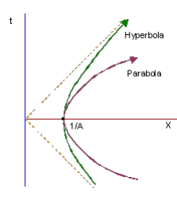

Space Robotics: Design Issues for Space & Planetary Robotics
=====

### Who drives Space Mission decisions in the UK? Who funds them?

* UK Gov't Office of Business, Innovation & Skills (BIS):
  * University & Science funding
* UK Space Agency (UKSA):
  * Founded 2010 (replaced BNSC)
  * Mission build support; UK Instruments
  * Industrial, Commercial & Science aspects
* Science & Technologies Facilities Council (STFC):
  * Partner UKSA
  * Science - side
  * Science exploitation
  * Engineering (particle physics, nuclear physics, space science & astronomy)
* ESA:  
  * Subscribe to base & 'optional' programmes
  * Investment comes back to UK in contracts & other funding ('geo-return')
  * Large stake in ExoMars (optional)

### Know about where you are going

* All about prolonging 'when' your robot will die
* Know risks and where failure could occur
* How far? What about radiation? How hot/cold? Does it have an atmosphere? Is it solid, liquid or gas?
* Launch failure - big profile news
* EDL: Entry, Descent & Landing
* When is a good time to go?

#### Mars Facts
* Mars Axial tilt = 25° (Earth is 23°)
* Similar ratio of day/night
* 1.5x distance from sun (~1/2 sunlight)
* 1 Martian year = 2 Earth years
* Seasons like on Earth, very elliptical orbit
* Southern hemisphere has harsher winter (further from the sun during winter than northern hemisephere)
* Some evidence Mars tilt has changed... (does the moon stabilise Earth's?)
* Arrive just after dust storms (Season 11)

### Ideal Robot Mass, Volume, Power

Mass:
* Lightweight, strong materials
* No out-gas or contaminate science instruments (e.g. no carbon fibre - throws off carbon readings)
* Science mass (scientists want everything) vs Engineering mass (Engineers don't want science pieces, want backup systems etc)

Volume:
* Fit everything within EDL vehicle

Power:
* Keeping electronics & battery warm consumes Power
* Budget power consumption against surface operations
* RTG (Radio Thermal Generators, big heavy, cannot switch off) vs Solar panels
* Thermal modeling is hard

> Space qualifying hardware:
  * Shaken on launch, frozen & baked
  * what's vulnerable on Mars?

Trade offs:
* Reduce volume by contracting wheels
* To do so, need extra mechanism (weight, more things to fail)

----

*5th November*

### What Rocket Launchers are there in Europe?

Ariane 5 ECA:
* French
* Payload capacity of 9,600kg
* Latest & most powerful in Ariane family
* Up to Geostationary Transfer Orbit (GTO)
* Can take large satellite (or 2 smaller)
* 140million € cost to launch
* Ariane 6 is under production & smaller

Soyuz-Fregat:
* Russian
* Reliable
* Astronauts -> ISS
* Fregat is upper-storage - gets you into upper orbit
* 4,100-5,500kg Payload
* ~35million € to launch
* Rumoured to only cost Russians 24million € to Launch

Proton-M:
* ExoMars Launcher
* ~55million €
* 6,700kg to Geostationary Transfer Orbit
* Initially ICBM Rocket
* 2 x launchers for ExoMars in return for instruments
* Couple of failures last year

Space-X Falcon:
* Commerical space-craft
* Delivers things to ISS
* Falcon X Heavy and XX Rumoured
* Falcon 9 payload = ~6,000 kg

### ΔV - Delta V, Hyperbolic versus Parabolic, EDLS?
* Want to be as low as possible
* Change in Velocity
* Determines how much fuel you need:
  * Changing velocity needs fuel
* Could use Planet's gravitational field to sling-shot:
  * Nearly all past the moon use this

* Hyperbolic entry:
  * landing site determined at launch
  * Beagle 2
  * Use less fuel
* Parabolic entry:
  * decided from orbit
  * better
  * plan where/when you can land

* EDLS: Entry, Descent and Landing:
  * Dead-beat gas bag
  * Bouncing inflated bags (above)
  * Retro-rockets
  * All contaminate landing site

### Communication, Tele-operation, Autonomy

* Usually work with available resources instead of creating own
* US Satellites etc
* Need backup if satellite goes down:
  * Antenna with low data rate
  * straight to/from earth

* Have to consider Light-Minutes
* Tele-operation on Moon (1.5 light-seconds), should have basic autonomy (traded)
* No Tele-operation on Mars unless in Orbit
* Will experiment tele-operating Bridget on Earth from ISS

* How much autonomy do you risk on a robot in space?

----

### Other notes

* Nav-cams in black & white, to get information to robot quickly
* Always try to talk to orbiter - less power needed
* 6-wheel chassis standard for mobility
* Rock Abrasion Tool = drill
