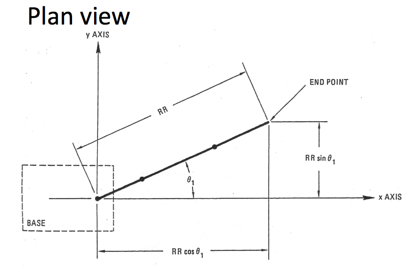

Space Robotics: Forward Kinematics
=====

Dynamics = velocity, (de)acceleration
Kinematics = movement

**Two Directions**:
* Forward
* Inverse (next notes)

----

* Given joint angles, where is the end effector?
* End effector = manipulator, drill etc

Movement (# of joints) *vs* Weight cost, computational load & manufacture cost

Orientation of delivering the end effector:
  * Can the elbow/wrist joint use roll or yaw?

** Roll - Pitch - Yaw**

#### Drilling on Mars
* Good roll/pitch/yaw?
* If can move the base, maybe only 1 needed - cheaper
* Deliver only the really necessary movements

Sometimes DOF (Degrees of Freedom) != # of joints:
  * Snake Robot
  * Many joints, few DOF

#### Space:
* Typically 5 DOF
* 4 DOF misses roll/pitch

* Where do motors live?
  * On the joint:
    * Weight on the arm (unstable)
  * Remote drives (belt/chain to transmit)
    * Gear train is heavy but accurate
    * Chain is better than belt

#### Kinematic Model
* Given physical structure we can build a schematic showing:
  * Lengths
  * Relative angles
  * How they can vary

#### Joints:
* Revolute:   
  * Relative angles of segments change
* Primatic:
  * Length of segments change
  * Less suitable for planetary work

Measurement:
* Motor encoders, sensors
* Require calibration
* Where is zero angle? (Needs specifying)

Conventions:
* z is 'up'
* 0° is horizontal (with regard to 'z')
* Need an origin (calibration access?)
* Only conventions (consistency required)

Roll & Pitch calculations:
* Two bevel gears
* 2 angles:
  * θ₄
  * θ₅

* Angle convention:
  * Up is positive
  * Clockwise is positive

* Quarter turn opposite way = 45% roll
* Quarter turn same way = 45% pitch

x,y,z required!

Calculate base -> end effector horizontally

Need to calculate height of end effector above base

> In diagram, do heights first, then widths. Then look down in plan view (below)

#### General solution:
* Denavit-Hartenberg conventions
* Translation & rotation between joints
* Sequence of transformations
* 3x3 transformation matrix for each
* Multiply the matrices
* Expensive
