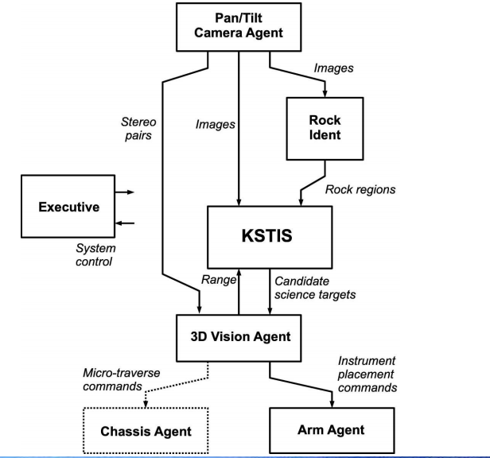

Space Robotics: Intro
======================

#### Learning Outcomes

* Detailed characteristics of space & planetary robot systems
* Potential space & planetary applications
* Design appropriate robotic solutions
* Understand the principles & trade-offs

#### Topics
 * History & Design Issues
 * Manipulator kinematics
 * Manipulator control & calibration
 * Rover navigation
 * Simulation
 * Autonomous architectures
 * Robot survivability & longevity

> 100 % Exam

> Read extra papers

> Do some maths

* Evaluate some equations
* Trig.

---

### Aberystwyth Space Robotics

#### Space Robotic Research focus:
* Robot enabled science sample/data acquisition
* Autonomous space & planetary robot control methods
* Advanced Computer Vision methods

#### Missions:
* [Beagle 2](https://en.wikipedia.org/wiki/Beagle_2)
* [ExoMars (first EU Mars rover)](https://en.wikipedia.org/wiki/ExoMars)
* Aurora Core programme
* [BeagleNET](http://www.unmannedspaceflight.com/lofiversion/index.php/t853.html)
* [Lunar Beagle](http://www.spaceflightnow.com/news/n0908/12beagle/)
* [MoonLITE](https://en.wikipedia.org/wiki/MoonLITE)
* [Marco Polo](https://en.wikipedia.org/wiki/Marco_Polo_(spacecraft))

#### ExoMars

##### PanCam Calibration Target (PCT)
* Stained glass targets (no fading)
* Good for planetary protection
* Can be steralised easily
* Glass surfance given [Lambertian reflectance](https://en.wikipedia.org/wiki/Lambertian_reflectance)
* Designed to be as small as possible to save weight
* Second smaller mounted further down on drill box

#### Fiducial Markers
* Known markers
* Can be used for calibration
* Can help reduce distortion of images
* [A fiducial marker or fiducial is an object placed in the field of view of an imaging system which appears in the image produced, for use as a point of reference or a measure.](https://en.wikipedia.org/wiki/Fiducial_marker)

#### Other Components
* Optical bench - rigid, mount cameras on here, includes pan/tilt
* Filter wheels (see below)
* Gigabit ethernet cameras
* 6xWheel drive, steer and walking
* Russian-made chassis
* Blodwen = 1/2 size of ExoMars Rover for lab testing

#### Filter Wheels:
* [ExoMars PanCam design showing the position of the filter wheel in front... - Scientific Figure on ResearchGate. Available from: http://www.researchgate.net/figure/258688266_fig5_ExoMars-PanCam-design-showing-the-position-of-the-filter-wheel-in-front-of-the-Wide-Angle [accessed Oct 8, 2015]](http://www.researchgate.net/figure/258688266_fig5_ExoMars-PanCam-design-showing-the-position-of-the-filter-wheel-in-front-of-the-Wide-Angle)
* http://www.modernastronomy.com/shop/filters-wheels/filter-wheels/brightstar/manual-filter-wheel-5-x-1-25/
* Lets you add a filter in front of the imaging equipment

#### AMASE
* Arctic Mars Analogue Svalbard Expedition

1. Calculate reflectance of rocks
2. Calibrate the cameras
3. Image true colour corrections

#### Multi-Spectral WACs and HRC:
* Wide Angle Camera
* High Resolution Camera

#### Mars soil simulant:
* Made in Germany
* Reverse-engineered Martian soil
* packs and slips in the same way
* very fine

#### ASTIA:
* Autonomous Science Target Identification & Acquisition

* Autonomously navigate, if see something 'interesting', readjust goal destination to there instead

---

### Other Rovers

#### Idris:
* Outdoor testing
* All-terrain
* Fred Labrosse's
* Laser scanner for collision detection
* Speech synthesisor

#### Bridget:
* Closer to ExoMars
* 6-wheel chassis
* Simulate traversing Mars
* SAFER - Sample Field Acquisition Experiment with a Rover
* Has a ground-penetrating radar

#### Arm Study:
* Beagle 2 'twin' arm
* Could it be reused for ExoMars?
* No arm on ExoMars now
* Limitations - low power, 1 joint moves at a time, slow
* Straight-line motion arm:
   * Extremely slow
   * needs to unfold from rover in first place
   * joints needed to change from ExoMars
   * however slow = can calculate statically

#### Lunar Beagle:
* Colin Pillenger
* Reuse Beagle technology on the moon
* Deployed by astronaut
* Sampling the moon without human input
* Feasibility study - didn't happen

---

### Aerobots

#### Aerobot ILP
* Atomosphere on Mars ~1/100th of Earth's
* Titan, Venus & Mars all good for balloons / flying
* Not as much control

#### PRoViScout Tethered Aerobot:
* Tethered to rover
* Rover follows pre-planned path
* Autonomous camera platform on aerobot
* Can reconstruct 3D landscape of the surrounding area from images

#### Autonomous Co-operant Aerobots:
* Group of 3 in Aber experiment
* Each autonomous, work together
* Never all identical in nature
* No computation on board - used external sensors to track each other
* Prone to confusion by drafts / gusts of wind
