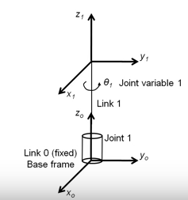

Forward Kinematics revision: Queensland Uni of Technology - Michael Milford
=====

Forward Kinematics:
* only 1 solution
* set should to x, elbow to y etc

> Inverse Kinematics - often has many ways to position joints to be able to reach a specific point

Link 0:
* Base frame
* Base of robot arm

θ₁ = Revolute joint

**Joint Variables**
* General joint variable qᵢ (joint # i)
* Revolute or prismatic
* Aᵢ = Aᵢ(qᵢ) is the transformation matrix form frame i-1 to i, derived from joint and link i

#### Kinematic Chain

Position and Orientation of the end effector can be described by the transformation matrix:

#### Complexity & Uniformity
* Could calculate forward kinematics by inspection and reasoning -> geometry
* Can be very complex -> lots of joints and links
* Need an approach which everyone can apply which simplifies things wherever possible

#### Denavit-Hartenberg Convention (DH)
* Each A matrix has 6 variables (as above):
  * 3 in the rotation matrix
  * 3 in the position vector (displacement)
* DH Parameters collapse 6 variables to 4 link parameters, provided we follow a certain procedure for setting coordinate frames:

#### Rules for assigning frames

**Rule 1:**
* Zᵢ₋₁ is axis of actuation of joint i
* Z axis of revolution of revolute joint
* Z axis of translation of prismatic joint

**Rule 2:**
* Axis xᵢ is set so it is perpendicular to and intersects Zᵢ₋₁

**Rules 3:**
* Derive yᵢ from xᵢ and zᵢ
* Using right hand rule

Rule 1: Base frame
* z₀ is the axis of actuation of joint 1
* x₀ and y₀ are set as convenient, provided they make a right-handed set (usually align with table/robot body)

Rule 1: Tool Frame
* Where rules allow:
  * z_n is approach direction of the Tool
  * y_n is the slide direction of the tool (gripper open/close)
  * x_n is the normal direction

